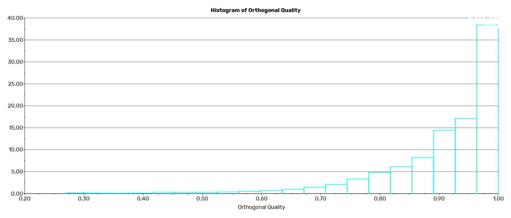
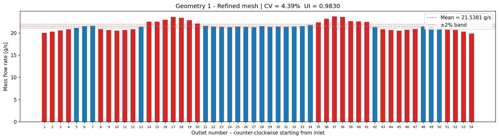
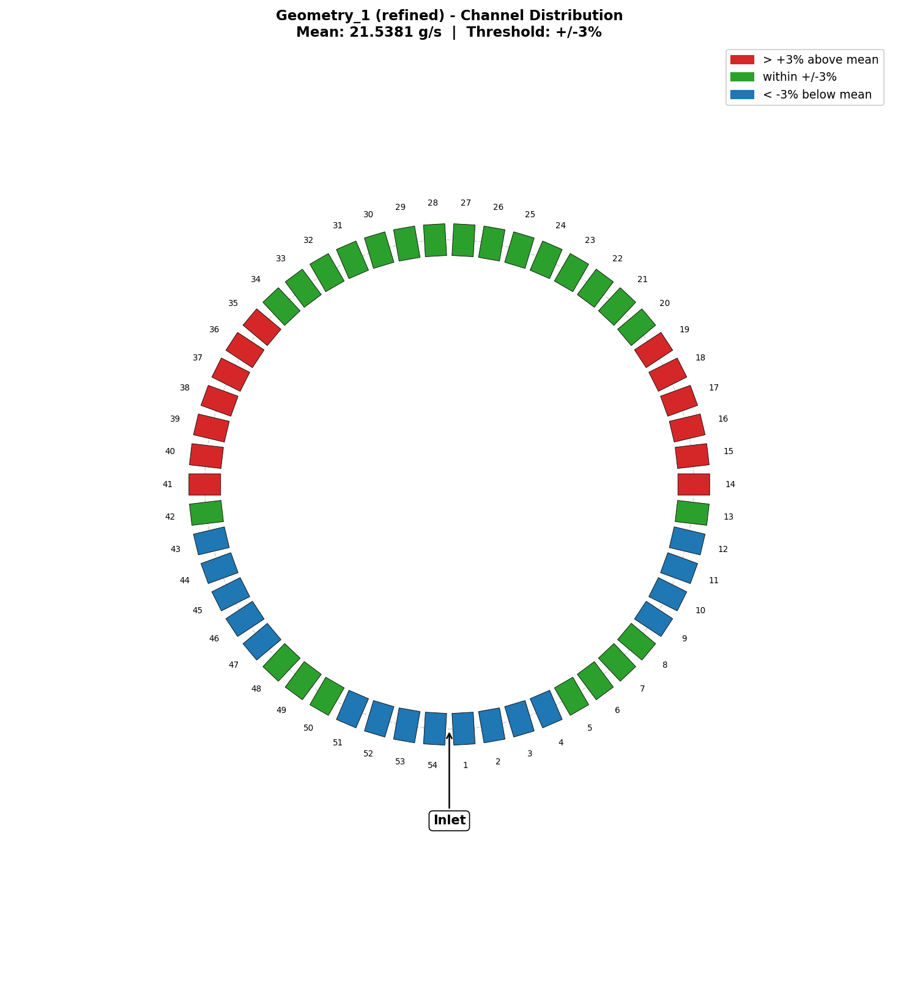
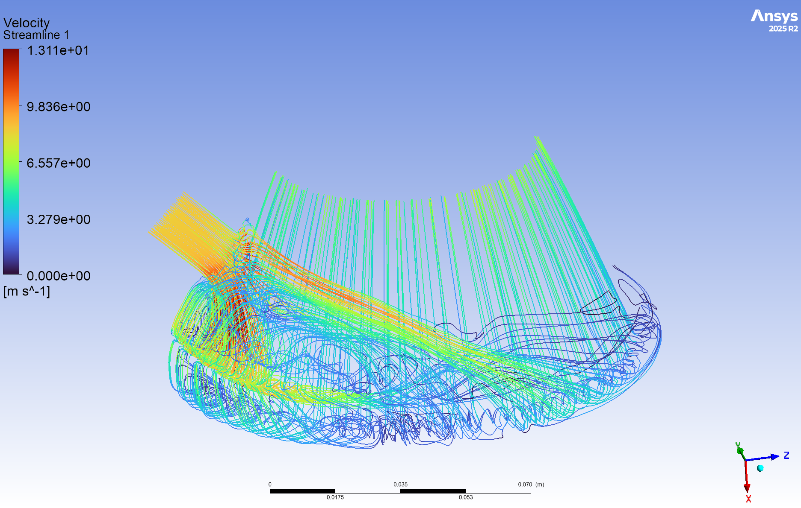
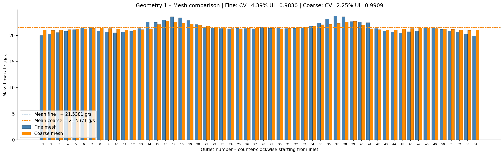

# Manifold CFD Post-Processing

Post-processing scripts and simulation results for an annular fuel distribution manifold —
part of the **WARR Rocketry** project *Nixus* thrust chamber development.

---

## 1. Overview

| | |
|---|---|
| **Goal** | Achieve uniform coolant mass flow across all 54 outlet channels of the annular manifold |
| **CFD solver** | Ansys Fluent 2025 R2 |
| **Post-processing** | Python 3.10 · NumPy · Matplotlib |
| **Key metrics** | Coefficient of Variation (CV), Uniformity Index (UI), pressure drop Δp |

**Uniformity metrics:**

- **CV** (Coefficient of Variation) — standard deviation / mean; lower is better
- **UI** (Uniformity Index) — ranges 0–1; 1 = perfectly uniform distribution
- **Δp** — total pressure drop from inlet to mean outlet total pressure

---

## 2. Approach

### Workflow

```
Step 1 – Geometry 1, coarse mesh   →   quick feasibility check, low compute cost
Step 2 – Geometry 1, refined mesh  →   physically accurate result, mesh independence
Step 3 – Compare coarse vs. refined mesh results
Step 4 – Geometry 2, refined mesh  →   geometry optimisation (in progress)
Step 5 – Compare Geometry 1 vs. Geometry 2 (auto-generated once Geom 2 data exists)
```

### Mesh settings

| | Coarse mesh | Refined mesh |
|---|---|---|
| Cells | ~3 million | ~7 million |
| Near-wall treatment | Wall functions | y+ ≈ 1 (fully resolved) |
| Turbulence model | k-epsilon (standard) | k-omega SST with Low-Re correction |
| Inlet BC | Mass flow inlet | Mass flow inlet |

The coarse mesh uses wall functions to avoid resolving the viscous sublayer,
which keeps cell count low for a fast initial assessment.
The refined mesh resolves the boundary layer down to y+ ≈ 1 with k-omega SST,
giving a more accurate prediction of secondary flows and outlet-to-outlet deviations.

### Mesh quality (Geometry 1, coarse)



---

## 3. Results — Geometry 1

| Metric | Coarse mesh | Refined mesh |
|---|---|---|
| Outlets | 54 | 54 |
| Mean mass flow [g/s] | 21.54 | 21.54 |
| CV [%] | 2.25 | 4.39 |
| Uniformity Index | 0.9909 | 0.9830 |
| Max deviation [%] | 8.22 | 17.98 |
| Pressure drop (refined) | — | **67.28 kPa** |

The refined mesh resolves localised flow structures near the outlets that the
coarse mesh smears out, leading to a higher measured CV. The refined result is
therefore physically more accurate.

### Mass flow distribution — refined mesh



### Channel distribution — circle view (refined)

Each rectangle represents one outlet channel, colour-coded by deviation from
the mean (red > +3 %, green within +/-3 %, blue < -3 %).



### 3D Streamlines (refined)



### Coarse vs. refined mesh comparison



---

## 4. Outlook & Conclusion

**Mesh independence:** The coarse and refined meshes show a CV difference of ~2 percentage
points (2.25 % vs. 4.39 %). The refined result is used as the baseline for geometry comparison
since it captures boundary-layer effects more faithfully.

**Non-uniformity pattern:** The largest deviations occur near the inlet region.
Outlets on the side closest to the inlet receive disproportionately high flow,
indicating a strong circumferential momentum imbalance entering the manifold ring.

**Next step — Geometry 2:** A modified manifold geometry is currently under simulation
(refined mesh only; no coarse mesh study needed since mesh independence has been
established for this outlet configuration). The design goal is a more uniform mass flow
distribution, ideally CV < 2 % across all 54 channels.

Once the Ansys Fluent exports for Geometry 2 are placed in
`Geometry_2/refined/CFD_Export/`, re-running the scripts generates the analysis
and comparison plots automatically:

```bash
python scripts/post_processing.py   # bar charts + comparisons
python scripts/circle_plot.py       # circle view per geometry
```

---

## Repository Structure

```
Geometry_1/
    plots/                   Geometry-level comparison plots
    coarse/
        CFD_Export/          Fluent surface-report exports (flow_rates, outlets_y, outlets_z)
        plots/               Bar chart, mesh quality image
    refined/
        CFD_Export/          Fluent exports (mass_flow_rates, y_coord, z_coord,
                                            avg_tot_pressure_out, pressure_in)
        plots/               Bar chart, circle plot, 3D streamlines

Geometry_2/
    refined/
        CFD_Export/          (populated once simulation is complete)
        plots/               (auto-generated on next script run)

scripts/
    post_processing.py       Full analysis: bar charts, mesh comparison, geometry comparison
    circle_plot.py           Circular outlet-distribution visualisation
```
